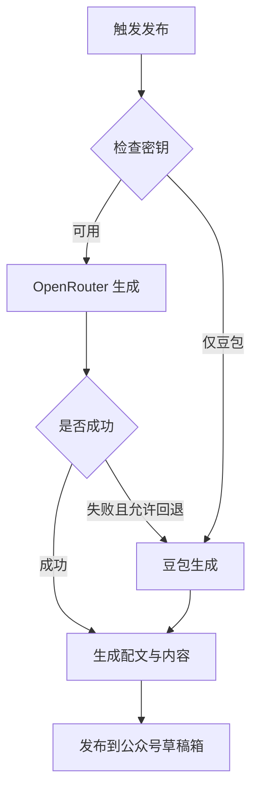

# 工作流程

本技能用于生成艺术写真并发布到公众号草稿箱。默认优先使用 OpenRouter，失败自动回退豆包。

## 运行逻辑

1. **检查环境变量**  
   - 发布必需：`WECHAT_API_KEY`  
   - 生成优先：`OPENROUTER_API_KEY` + `IMGBB_API_KEY`  
   - 回退备用：`DOUBAO_API_KEY`
2. **生成图片**  
   - 优先调用 `generate_artistic.py`（OpenRouter）  
   - 若失败且允许回退，切换 `generate_beauty.py`（豆包）
3. **组装内容**  
   - 生成标题与一句话配文  
   - 将图片 URL 以小绿书格式拼接为 Markdown
4. **发布草稿**  
   - 调用发布 API 写入公众号草稿箱

## 主要入口

- 手动发布：`scripts/publish_wechat.py`  
- 定时发布：`scripts/auto_publish.py`

## 流程图

