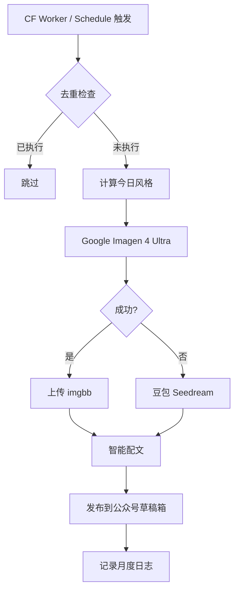

# 工作流程 V8.0

## 运行逻辑

1. **触发**
   - 主要：Cloudflare Worker → `repository_dispatch` (UTC 11:30 / 北京 19:30)
   - 备用：GitHub Actions `schedule` (UTC 12:00 / 北京 20:00)
   - 去重：每日只执行一次，后到的自动跳过

2. **风格轮换**
   - 周一: 性感系/挑逗 | 周二: 甜美系/俏皮 | 周三: 知性系/自信
   - 周四: 冷艳系/神秘 | 周五: 御姐系/高冷 | 周六: 性感系/挑逗 | 周日: 清纯系/温柔

3. **图片生成**（`generate_beauty.py`）
   - 优先: Google Imagen 4 Ultra → imgbb 上传获取 URL
   - 回退: 豆包 Seedream 4.5（自带 URL）
   - Prompt: 从元素库随机组合（脸型/发型/穿搭/场景/光影/艺术风格）

4. **组装发布**（`publish_wechat.py`）
   - 智能配文：100+ 配文库，按情绪/场景分类
   - 小绿书格式：图片 + 配文 + 话题标签
   - 发布到「三更熟」公众号草稿箱

5. **日志记录**
   - 按月分文件：`workflow_logs/actions_runs_YYYY-MM.md`
   - 记录风格/状态/触发方式

## 流程图

```mermaid
flowchart TD
  A[CF Worker / Schedule 触发] --> B{去重检查}
  B -->|已执行| SKIP[跳过]
  B -->|未执行| C[计算今日风格]
  C --> D[Google Imagen 4 Ultra]
  D --> E{成功?}
  E -->|是| F[上传 imgbb]
  E -->|否| G[豆包 Seedream]
  F --> H[智能配文]
  G --> H
  H --> I[发布到公众号草稿箱]
  I --> J[记录月度日志]
```
