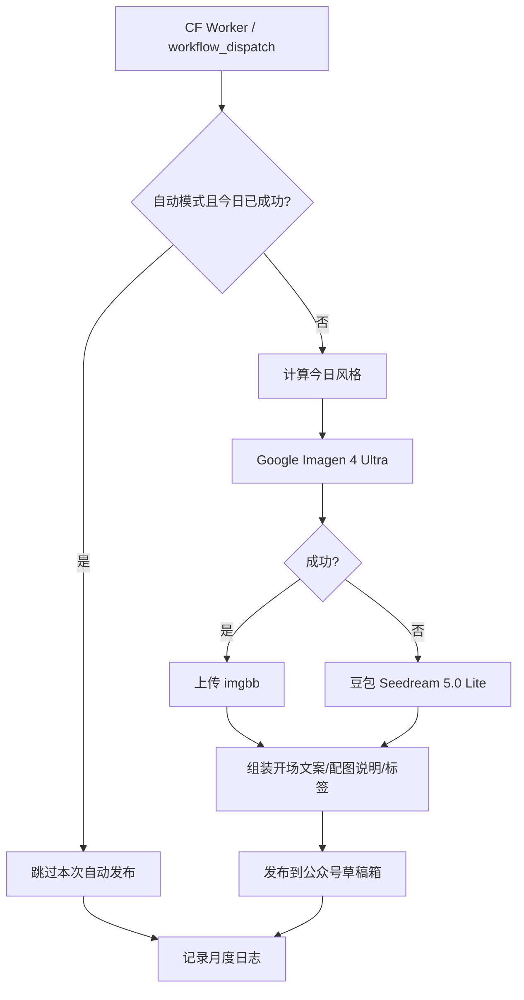

# 工作流程 V10.0

## 运行逻辑

1. **触发**
   - 自动：Cloudflare Worker → `repository_dispatch`，并保留 GitHub Actions `schedule` 兜底（UTC 12:00 / 北京 20:00）
   - 手动：GitHub Actions `workflow_dispatch`
   - 防并发：同一分支通过 `concurrency` 串行执行
   - 防重复：自动触发前先检查 GitHub Actions 当日成功记录，再回查远端月度日志，当天已有成功记录则跳过

2. **风格轮换**
   - 周一: 性感系/挑逗 | 周二: 甜美系/俏皮 | 周三: 国风系/温柔
   - 周四: 邻家女孩系/温柔 | 周五: 职场系/自信 | 周六: 生活场景系/微笑 | 周日: 清纯系/性感

3. **图片生成**（`generate_beauty.py`）
   - 优先: Google Imagen 4 Ultra → imgbb 上传获取 URL（429 限流时先退避重试，并在当前运行内短暂跳过后续 Google 尝试）
   - 回退: 豆包 Seedream 5.0 Lite（自带 URL）
   - Prompt: 从元素库随机组合（脸型/发型/穿搭/场景/光影/艺术风格）

4. **组装发布**（`publish_wechat.py`）
   - 开场文案：支持 `--caption`，也可基于场景/情绪自动生成
   - 智能配文：按图片元数据生成单图说明和话题标签
   - HTTPS：默认启用证书校验，证书异常时可临时回退并打印告警
   - 小绿书格式：图片 + 配文 + 话题标签
   - 发布到「三更熟」公众号草稿箱

5. **日志记录**
   - 按月分文件：`workflow_logs/actions_runs_YYYY-MM.md`
   - 记录风格/状态/触发方式

## 流程图

```mermaid
flowchart TD
  A[CF Worker / workflow_dispatch] --> B{自动模式且今日已成功?}
  B -->|是| C[跳过本次自动发布]
  B -->|否| D[计算今日风格]
  D --> E[Google Imagen 4 Ultra]
  E --> F{成功?}
  F -->|是| G[上传 imgbb]
  F -->|否| H[豆包 Seedream 5.0 Lite]
  G --> I[组装开场文案/配图说明/标签]
  H --> I
  I --> J[发布到公众号草稿箱]
  C --> K[记录月度日志]
  J --> K
```
